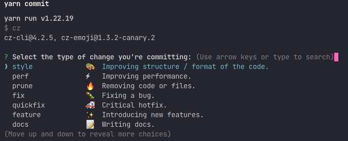

🚧 UNDER CONSTRUCTION
# 💻 Shadowcode
📚 Education based IDE for learning software development

## 👩‍💻 Get Started
There are a variety of commands to use during the development process. 
___

### Development Server

🖥 Desktop
```
yarn tauri dev
```

🌐 Web
```
yarn dev
```

### Build Application

🖥 Desktop

``` 
yarn tauri build
```

🌐 Web

``` 
yarn build
```

### Commit Work
To maintain consistent commit messages we will be using commitizen along with cz-emoji. 
A script has been added for convenience. 

```
yarn commit
```

